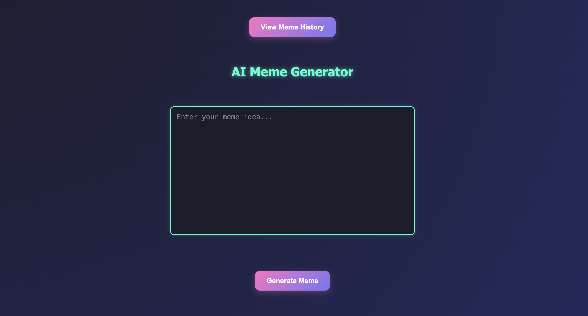

# 🧠 AI Meme Generator

Generate memes from text prompts using AI!  
This is a personal pet project built with Django and Hugging Face's text-to-image models.

---

## 🚀 Features

- 🔤 Enter any prompt — get a unique meme image
- 🎨 Styled frontend with textarea + image output
- 🧠 Uses Hugging Face Inference API for image generation
- 🥘 History page — stores all generated memes in database
- 📆 Pagination for browsing past memes
- 🔐 API key is secured via `.env` (not exposed on GitHub)

---

## 👷️ Tech Stack

- 🐍 Python 3.12
- 🌐 Django 5.1
- 🧠 Hugging Face Inference API
- 📂 SQLite (default Django DB)
- 💅 HTML/CSS for frontend styling

---

## 📷 Screenshots



---

## ⚙️ Setup

### 1. Clone the repository

```bash
git clone https://github.com/your-username/ai-meme-generator.git
cd ai-meme-generator
```

### 2. Create and activate a virtual environment

```bash
python3 -m venv venv
source venv/bin/activate
```

### 3. Install dependencies

```bash
pip install -r requirements.txt
```

### 4. Create `.env` file

```env
HUGGINGFACE_API_TOKEN=your_hf_api_token_here
```

### 5. Run migrations

```bash
python manage.py migrate
```

### 6. Run the server

```bash
python manage.py runserver
```

---

## 📄 Project Structure

```
meme-generator/
│
├── memes/                # App folder
│   ├── templates/memes/  # HTML templates
│   ├── static/memes/     # CSS files
│   └── models.py         # Meme model
│
├── meme_generator/       # Project config
├── .env                  # API key (not committed)
├── .gitignore
└── manage.py
```

---

## ✅ To Do (optional)

- [x] Meme generation from prompt
- [x] Save to DB + display history
- [ ] User accounts / login
- [ ] Download/share memes
- [ ] Custom settings for generation
- [ ] Improve image quality (switch models)

---

## 📜 License

This project is for educational purposes.  
For commercial use of models, refer to [stability.ai/license](https://stability.ai/license).

